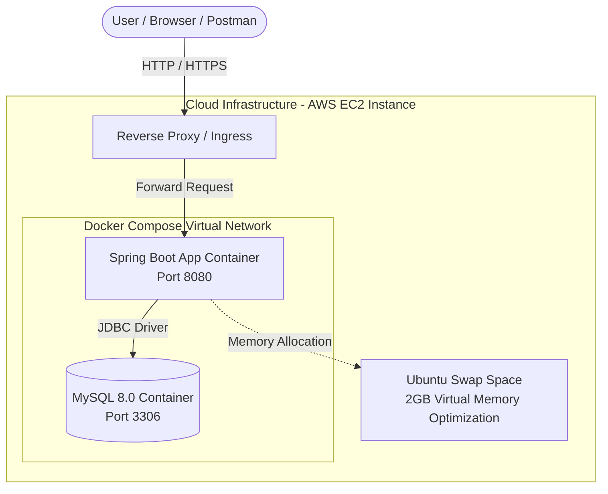
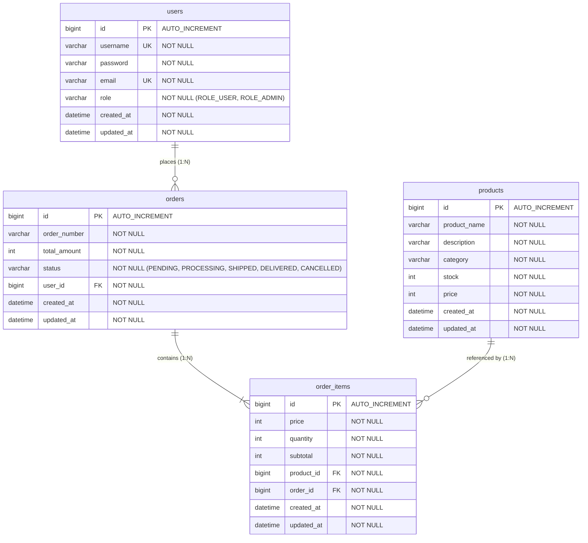
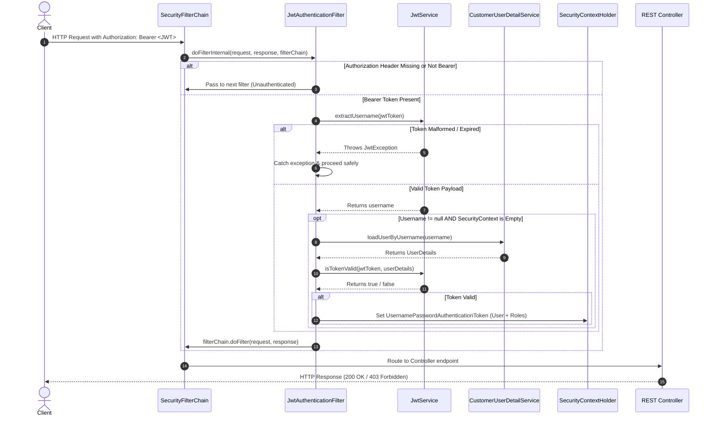

# 🛒 E-Commerce Backend REST API

A robust, enterprise-ready **E-Commerce Backend RESTful Service** built with **Java 21**, **Spring Boot 3.5**, **Spring Security (JWT)**, **Spring Data JPA**, **MySQL 8.0**, and **OpenAPI/Swagger 3.1**.

This repository delivers stateless JWT-based security, flexible product catalog search & filtering via JPA Specifications, dynamic pagination, atomic multi-item order processing, and Docker containerization ready for cloud deployment on AWS EC2.

---

## 📋 Table of Contents
- [Architecture & Infrastructure](#-architecture--infrastructure)
- [System Linkage Diagram](#-system-linkage-diagram)
- [Database Schema Design (ERD)](#-database-schema-design-erd)
- [JWT Authentication Flow](#-jwt-authentication-flow)
- [Core Features](#-core-features)
- [Tech Stack & Dependency Matrix](#-tech-stack--dependency-matrix)
- [Interactive OpenAPI / Swagger Documentation](#-interactive-openapi--swagger-documentation)
- [Local Setup & Running](#-local-setup--running)
- [Docker & Docker Compose Setup](#-docker--docker-compose-setup)
- [AWS Cloud Deployment Guide](#-aws-cloud-deployment-guide)
- [API Endpoints Overview](#-api-endpoints-overview)

---

## 🏗️ Architecture & Infrastructure

The application runs in a containerized environment powered by **Docker Compose**, orchestrating a **Spring Boot Backend Application** and a **MySQL 8.0 Database** service.



---

## 🔗 System Linkage Diagram

The diagram below maps how requests move through Spring Security filters, Controllers, Services, Repositories, and Data Models.

```mermaid
graph TD
    Client[Client / Postman / Swagger UI]

    subgraph Security Layer
        SF[SecurityFilterChain]
        JWTF[JwtAuthenticationFilter]
        UserDetailSvc[CustomerUserDetailService]
        JWTService[JwtService]
    end

    subgraph Presentation Layer - Controllers
        AC[AuthController]
        UC[UserController]
        PC[ProductController]
        OC[OrderController]
        GEH[GlobalExceptionHandler]
    end

    subgraph Data Transfer Layer
        DTOs[DTOs: AuthResponse, OrderRequest, ProductRequest, UserRequest, etc.]
    end

    subgraph Service Layer - Business Logic
        US[UserService / UserServiceImpl]
        PS[ProductService / ProductServiceImpl]
        OS[OrderService / OrderServiceImpl]
    end

    subgraph Persistence Layer - Repositories
        UR[UserRepository]
        PR[ProductRepository]
        OR[OrderRepository]
        OIR[OrderItemRepository]
        PFS[ProductSpecifications]
    end

    subgraph Database Entities
        E_User[(User)]
        E_Product[(Product)]
        E_Order[(Order)]
        E_OrderItem[(OrderItem)]
    end

    Client -->|HTTP Request| SF
    SF --> JWTF
    JWTF -->|1. Validate Token| JWTService
    JWTF -->|2. Load User| UserDetailSvc
    JWTF -->|3. Set SecurityContext| SecurityContextHolder[SecurityContextHolder]
    
    SecurityContextHolder -->|Authorized Request| Presentation Layer - Controllers

    AC -->|Auth Requests| US
    AC -->|Generate JWT| JWTService
    UC -->|Manage Users| US
    PC -->|Manage Products & Filtering| PS
    OC -->|Place / View Orders| OS
    
    AC & UC & PC & OC -. Uses .-> DTOs
    AC & UC & PC & OC -. Exception Thrown .-> GEH

    US --> UR
    PS --> PR
    PS --> PFS
    OS --> OR
    OS --> OIR
    OS --> PR

    UR --> E_User
    PR --> E_Product
    OR --> E_Order
    OIR --> E_OrderItem
```

---

## 🗄️ Database Schema Design (ERD)

Relational database model designed with strict integrity constraints, foreign key mappings, and auditing metadata (`created_at`, `updated_at`).



---

## 🔐 JWT Authentication Flow

`JwtAuthenticationFilter` extends `OncePerRequestFilter` to intercept HTTP calls, validate Bearer tokens, and establish security context.



---

## ⭐ Core Features

### 1. Authentication & Security
- **Stateless Authentication:** Register (`/api/auth/register`) and Login (`/api/auth/login`) with BCrypt password hashing.
- **Role-Based Access Control (RBAC):** Public endpoints, Customer-specific routes (`ROLE_USER`), and Administrative operations (`ROLE_ADMIN`).
- **JWT Middleware Filter:** Custom `JwtAuthenticationFilter` extracting HMAC-SHA key signed tokens.

### 2. Product Catalog & Advanced Search
- **Product Management:** Full CRUD operations for products.
- **Dynamic Specification Filtering:** Combine search queries (`search`), category (`category`), and price constraints (`minPrice`, `maxPrice`) using Spring Data JPA Specifications.
- **Pagination & Dynamic Sorting:** Custom page size (`pageSize`), page offset (`pageNumber`), and field sorting (`sortBy`, `sortDir`).

### 3. Order Processing Engine
- **Transactional Orders:** Multi-line order creation calculating item subtotals and grand totals atomically.
- **Order Lifecycle Management:** Status transitions (`PENDING`, `PROCESSING`, `SHIPPED`, `DELIVERED`, `CANCELLED`).

### 4. Enterprise Quality & Documentation
- **Centralized Error Handling:** Global `@RestControllerAdvice` mapping custom exceptions (`UserAlreadyExistsException`, `ResourceNotFoundException`, `UnauthorizedActionException`) to standardized `ApiError` payloads.
- **Interactive Swagger UI:** Embedded OpenAPI 3.1 documentation with global Bearer Auth button.

---

## 🛠️ Tech Stack & Dependency Matrix

| Layer / Concern | Technology / Library | Version | Purpose |
| :--- | :--- | :--- | :--- |
| **Language** | Java | 21 (LTS) | Core programming language leveraging modern syntax and performance. |
| **Framework** | Spring Boot | 3.5.14 | Application framework for standalone, production-ready microservices. |
| **Security** | Spring Security | 3.5.14 | Authorization framework supporting RBAC and stateless HTTP security. |
| **Authentication** | JJWT (`jjwt-api`, `jjwt-impl`) | 0.13.0 | Creation, parsing, and cryptographic verification of JWTs. |
| **Persistence** | Spring Data JPA / Hibernate | 3.5.14 | ORM framework for DB interactions, entity mappings, and JPA Criteria queries. |
| **Database** | MySQL Server | 8.0 | High-performance relational database management system. |
| **API Documentation**| Springdoc OpenAPI Starter UI | 2.8.5 | Auto-generates Swagger UI 3.1 documentation from controller annotations. |
| **Boilerplate Reduction**| Project Lombok | Latest | Annotations for getters, setters, constructors, builders (`@Builder`). |
| **Validation** | Spring Validation / Jakarta | 3.5.14 | Bean validation rules (`@Email`, `@NotNull`, `@NotBlank`). |
| **Containerization**| Docker & Docker Compose | 3.8 Spec | Multi-container application runtime (App + Database). |

---

## 📘 Interactive OpenAPI / Swagger Documentation

The project incorporates **Springdoc OpenAPI 3.1**, giving developers an interactive web dashboard to explore and test endpoints without third-party API clients.

### Accessing Swagger UI
When the application is running, open your browser and navigate to:
```
http://localhost:8080/swagger-ui/index.html
```
*(OpenAPI JSON spec is available at `http://localhost:8080/v3/api-docs`)*

### Authenticating in Swagger UI
1. Execute the `/api/auth/login` endpoint with your registered credentials.
2. Copy the returned JWT token string from the JSON response.
3. Click the **Authorize** button (🔒) at the top right of the Swagger UI page.
4. Paste your token into the **Value** input field (`Bearer <token>` or plain JWT depending on config) and click **Authorize**.
5. All protected `/api/users/**`, `/api/products/**` (POST/PUT/DELETE), and `/api/orders/**` endpoints can now be executed directly from your browser!

---

## 🚀 Local Setup & Running

### Prerequisites
- **JDK 21** installed and configured in `JAVA_HOME`.
- **Maven 3.8+** (or use the included `./mvnw` wrapper).
- **MySQL 8.0** running locally.

### Steps
1. **Clone the repository:**
   ```bash
   git clone https://github.com/2005rishabh/ecommerce-backend.git
   cd ecommerce-backend
   ```

2. **Configure Database Connection:**
   Update `src/main/resources/application.properties` with your local MySQL credentials:
   ```properties
   spring.datasource.url=jdbc:mysql://localhost:3306/ecommerce_db?createDatabaseIfNotExist=true
   spring.datasource.username=root
   spring.datasource.password=yourpassword
   ```

3. **Build and Run:**
   ```bash
   ./mvnw clean package -DskipTests
   java -jar target/ecommerce-backend-0.0.1-SNAPSHOT.jar
   ```

---

## 🐳 Docker & Docker Compose Setup

Run the entire application stack (Spring Boot + MySQL) using Docker in a single command.

### 1. Build & Run Containers
```bash
# Package the JAR file
./mvnw clean package -DskipTests

# Build and start Docker containers
docker-compose up --build -d
```

### 2. Verify Container Status
```bash
docker-compose ps
```

### 3. Container Services
- **Backend Application:** `http://localhost:8080`
- **MySQL Database:** `localhost:3307` (mapped internally to 3306)

### 4. Shutdown
```bash
docker-compose down -v
```

---

## ☁️ AWS Cloud Deployment Guide

When deploying to an AWS EC2 instance (e.g., `t2.micro` / `t3.micro` free tier with 1GB RAM), memory pressure can cause Java applications or MySQL containers to crash. Setting up **Swap Space** ensures optimal stability.

### 1. Configure Swap Space on Ubuntu EC2
```bash
# Allocate 2GB swap file
sudo fallocate -l 2G /swapfile
sudo chmod 600 /swapfile
sudo mkswap /swapfile
sudo swapon /swapfile

# Make swap permanent across reboots
echo '/swapfile swap swap defaults 0 0' | sudo tee -a /etc/fstab
```

### 2. Clone & Deploy via Docker Compose
```bash
git clone https://github.com/2005rishabh/ecommerce-backend.git
cd ecommerce-backend
./mvnw clean package -DskipTests
sudo docker-compose up -d --build
```

---

## 📌 API Endpoints Overview

| Method | Endpoint | Access Level | Description |
| :--- | :--- | :--- | :--- |
| **POST** | `/api/auth/register` | Public | Register new user account |
| **POST** | `/api/auth/login` | Public | Authenticate user & receive JWT token |
| **GET** | `/api/products` | Public | Get paginated products with search & filters |
| **GET** | `/api/products/{id}` | Public | Get product details by ID |
| **POST** | `/api/products` | `ROLE_ADMIN` | Create a new product |
| **PUT** | `/api/products/{id}` | `ROLE_ADMIN` | Update product details |
| **DELETE**| `/api/products/{id}` | `ROLE_ADMIN` | Delete product |
| **GET** | `/api/users` | `ROLE_ADMIN` | Retrieve all registered users |
| **GET** | `/api/users/{id}` | `ROLE_ADMIN` | Retrieve user by ID |
| **DELETE**| `/api/users/{id}` | `ROLE_ADMIN` | Delete user profile |
| **POST** | `/api/orders` | `ROLE_USER`, `ROLE_ADMIN` | Place new order |
| **GET** | `/api/orders` | `ROLE_USER`, `ROLE_ADMIN` | Get orders for logged-in user |
| **GET** | `/api/orders/{id}` | `ROLE_USER`, `ROLE_ADMIN` | Get order details by ID |
| **PUT** | `/api/orders/{id}/status` | `ROLE_ADMIN` | Update order status |
| **DELETE**| `/api/orders/{id}` | `ROLE_USER`, `ROLE_ADMIN` | Cancel an order |
