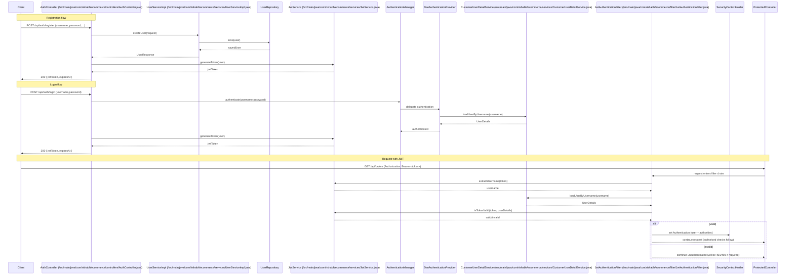

# Authentication Flow — ecommerce-backend

This document describes the full authentication flow in the project, mapping responsibilities to specific files and showing a sequence diagram for registration, login, and request validation with JWTs.

## Files involved

- `src/main/java/com/rishabh/ecommerce/config/SecurityConfig.java`
- `src/main/java/com/rishabh/ecommerce/config/ApplicationConfig.java`
- `src/main/java/com/rishabh/ecommerce/services/CustomerUserDetailService.java`
- `src/main/java/com/rishabh/ecommerce/services/JwtService.java`
- `src/main/java/com/rishabh/ecommerce/filter/JwtAuthenticationFilter.java`
- `src/main/java/com/rishabh/ecommerce/controllers/AuthController.java`
- `src/main/java/com/rishabh/ecommerce/services/UserServiceImpl.java`
- `src/main/java/com/rishabh/ecommerce/util/AuthorityUtil.java` and `src/main/java/com/rishabh/ecommerce/entities/Role.java`
- `src/main/java/com/rishabh/ecommerce/repositories/UserRepository.java` and the `User` entity

## High-level responsibilities

- `ApplicationConfig`: creates `PasswordEncoder`, `AuthenticationProvider` (DaoAuthenticationProvider), and exposes `AuthenticationManager`.
- `SecurityConfig`: defines HTTP security rules, stateless sessions, registers the `authenticationProvider`, and inserts `JwtAuthenticationFilter` into the chain.
- `CustomerUserDetailService`: implements `UserDetailsService` to load user data (username, encoded password, authorities) from DB.
- `JwtService`: generates, signs, parses, and validates JWT tokens.
- `JwtAuthenticationFilter`: extracts JWT from `Authorization` header, validates it, and sets Spring Security `Authentication` in `SecurityContextHolder`.
- `AuthController`: handles `/api/auth/register` and `/api/auth/login`, issues JWTs.
- `UserServiceImpl`: creates users (encodes passwords) and implements user-related operations.

## Step-by-step flow

1. Application startup and wiring

- `ApplicationConfig` registers core beans (`PasswordEncoder`, `DaoAuthenticationProvider`, `AuthenticationManager`).
- `SecurityConfig` configures rules and adds `JwtAuthenticationFilter` before `UsernamePasswordAuthenticationFilter`, and registers the `authenticationProvider` bean.

2. Registration (client -> `POST /api/auth/register`)

- `AuthController.register` receives `UserRequest` and calls `UserService.createUser` (`UserServiceImpl`).
- `UserServiceImpl` validates uniqueness, encodes the password via `PasswordEncoder`, saves `User` via `UserRepository`, and returns `UserResponse`.
- `AuthController` loads the saved `User` and calls `JwtService.generateToken(user)` which:
  - sets subject = username
  - adds a `role` claim (authority string)
  - sets issuedAt and expiration (6 hours)
  - signs the token with an HMAC key derived from `jwt.secret` (base64)
- Controller returns `AuthResponse` with `jwtToken`, `username`, and `expiresAt`.

3. Login (client -> `POST /api/auth/login`)

- `AuthController.login` calls `authenticationManager.authenticate(new UsernamePasswordAuthenticationToken(username,password))`.
- `AuthenticationManager` delegates to `DaoAuthenticationProvider`:
  - `DaoAuthenticationProvider` calls `CustomerUserDetailService.loadUserByUsername(username)` to obtain `UserDetails`.
  - It verifies the password using the configured `PasswordEncoder`.
  - On success, authentication completes and control returns to `AuthController`.
- `AuthController` then calls `JwtService.generateToken(user)` and returns the token in `AuthResponse`.

4. Accessing protected endpoints with JWT (client -> protected endpoint)

- Client sends `Authorization: Bearer <token>` header.
- `JwtAuthenticationFilter` (executing for each request) does:
  - Reads `Authorization` header; if missing or not `Bearer `, the filter proceeds without setting authentication.
  - Extracts token and calls `jwtService.extractUsername(token)` to parse subject.
  - If username present and no existing `SecurityContext` authentication:
    - Loads `UserDetails` via `CustomerUserDetailService`.
    - Calls `jwtService.isTokenValid(token, userDetails)` which checks subject matches and token not expired.
    - If valid, creates `UsernamePasswordAuthenticationToken` with `userDetails` and authorities and sets it into `SecurityContextHolder`.
  - If token is invalid or parsing fails, the filter logs and leaves the request unauthenticated.
- After the filter, Spring Security enforces `SecurityConfig` authorization rules (`hasRole(
`hasRole(...)`/`hasAnyRole(...)`) and returns `401`for unauthenticated or`403` for insufficient authority.

## Sequence diagram

## Token format and security details

- Signing: tokens are HMAC-signed with the key derived from `jwt.secret` (base64) using `io.jsonwebtoken.security.Keys.hmacShaKeyFor`.
- Lifetime: tokens are issued with a 6-hour expiration (set when generating tokens in `JwtService`).
- Claims: subject = username; `role` claim present for convenience, but final authorization uses `GrantedAuthority` set on the `Authentication` object.

## Failure modes and important notes

- Invalid or malformed JWTs: `JwtAuthenticationFilter` catches `JwtException`, logs, and does not set authentication; protected endpoints then return `401`/`403` as appropriate.
- Expired tokens: `JwtService.isTokenValid` will detect expiry and return false.
- Password changes / user deletion: current implementation only checks username and expiration. There is no built-in token revocation; tokens remain valid until expiry unless additional checks are added.
- Authentication exceptions during login (bad credentials) are thrown by `AuthenticationManager` / `DaoAuthenticationProvider` and should be handled by global exception handlers or will result in 401 responses.

## Quick file mapping (where to look)

- `ApplicationConfig` -> `src/main/java/com/rishabh/ecommerce/config/ApplicationConfig.java`
- `SecurityConfig` -> `src/main/java/com/rishabh/ecommerce/config/SecurityConfig.java`
- `JwtService` -> `src/main/java/com/rishabh/ecommerce/services/JwtService.java`
- `JwtAuthenticationFilter` -> `src/main/java/com/rishabh/ecommerce/filter/JwtAuthenticationFilter.java`
- `AuthController` -> `src/main/java/com/rishabh/ecommerce/controllers/AuthController.java`
- `UserServiceImpl` -> `src/main/java/com/rishabh/ecommerce/services/UserServiceImpl.java`
- `CustomerUserDetailService` -> `src/main/java/com/rishabh/ecommerce/services/CustomerUserDetailService.java`

---

Generated on: 2026-09-03
